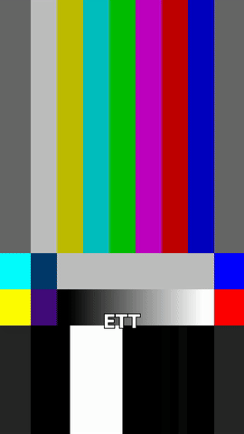
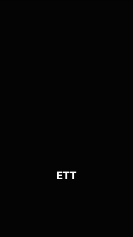

# Saved animations

Paste the snippet into a project's `overlays.json` and replace the phrases with
words you actually say. Every `cue` is a phrase, never a time.

Written by `python pipeline/animate.py`, which also renders the previews. Add a
`.json` here and run it again rather than editing this file.


## Hook push



**What it does.** The picture snaps in 20% over 300ms, holds for the whole sentence, and snaps back out over 300ms finishing exactly on the cut. A slight blur rides the two ramps and is zero while it holds. It scales the footage itself, not a layer over it, so captions and the hook card stay put. It must be told where to end: with no ending it holds the picture cropped for the rest of the video. Use `untilEndOf` and name the hook's last word -- `until` leaves as a phrase BEGINS, so naming the next sentence ends the zoom a fraction inside it.

**When to reach for it.** The opening claim, and nothing else. It makes a vocal hook land harder by being already there while the words arrive. Anywhere else it stops reading as emphasis and starts reading as a camera drifting. One per video.

**Seen in.** aieditoradvancing -- the standard opener from here on

```json
{
  "kind": "push",
  "from": "start",
  "untilEndOf": "the hook's own last word"
}
```


## Files, named one at a time



**What it does.** Each box fades in rising as you name it, and nothing is shown before. They leave together, falling, on a phrase you choose. The first box sits where it will sit once they are all there, not centred alone, so nothing slides sideways when the second arrives.

**When to reach for it.** Boxes naming things that do not exist yet when the sentence starts -- two files being written, one after the other. Showing a waiting slot would promise something the viewer has no way to guess.

**Seen in.** vas3 -- Claude.md then Prompts.md, through the structure section

```json
{
  "kind": "chipRow",
  "reveal": "enter",
  "row": 1,
  "until": "the phrase they all leave on",
  "chips": [
    {
      "text": "Claude.md",
      "cue": "brief"
    },
    {
      "text": "Prompts.md",
      "cue": "prompt-dokument"
    }
  ]
}
```


## Logos, sharpening as you name them

No preview here: it draws robot.png, higgsfield.png, claude.png, which belongs to the project that uses it. Render one against your own copies.

**What it does.** Every logo on screen from the first frame, blurred past recognition, and each one snaps into focus as you say what it is. The row holds its layout, so a card coming into focus never shifts its neighbours, and each logo is fitted into the same square whatever shape its file is.

**When to reach for it.** Naming two or three products or tools in one breath. The words go by faster than a viewer can picture them, and the blur says how many are coming without giving away what they are. Reach for chipRow instead when the things being named are categories rather than products with a mark.

**Seen in.** aivoiceagents -- chattbottar / videogenerering / kodning

```json
{
  "kind": "iconRow",
  "cue": "the phrase that puts the row on screen, blurred",
  "until": "the phrase it should leave on",
  "slots": [
    {
      "name": "CHATTBOTTAR",
      "src": "robot.png",
      "cue": "chattbottar"
    },
    {
      "name": "VIDEOGENERERING",
      "src": "higgsfield.png",
      "cue": "videogenerering"
    },
    {
      "name": "KODNING",
      "src": "claude.png",
      "cue": "kodning"
    }
  ]
}
```


## Process terminal


**What it does.** A terminal card in the middle third of the frame, output arriving line by line. The lines are paced to finish on a word you choose, then the card holds until a later phrase and goes. The face stays visible around it.

**When to reach for it.** A sentence describing a process with steps -- raw file in, edit out. Generated rather than captured, so it costs no screen recording. Reference only: it was built for one video and has not been reused yet, so treat it as a starting point rather than a proven look.

**Seen in.** aieditoradvancing -- 'du bara slänger in din RAW-file och så gör den om den till en edit'

```json
{
  "kind": "terminal",
  "cue": "the phrase it appears on",
  "finishBy": "the word its output should finish on",
  "until": "the phrase it leaves on",
  "lines": [
    "raw_footage.mp4",
    "→ analyserar",
    "→ klipper",
    "→ captions",
    "edit.mp4 ✓"
  ]
}
```


## Upcoming steps, blurred


**What it does.** Every box on screen from the first frame, unreadable, and each one sharpens as you name it. The row holds its layout, so a box coming into focus never shifts its neighbours.

**When to reach for it.** A list the video is about to walk through, one item per section. The viewer can see that three topics are coming and cannot read ahead to what they are -- which is the reason to show them early rather than one at a time.

**Seen in.** vas3 -- planering / struktur / utforande, held across the whole clip

```json
{
  "kind": "chipRow",
  "cue": "the phrase that puts the row on screen, blurred",
  "until": "end",
  "chips": [
    {
      "text": "PLANERING",
      "cue": "planering"
    },
    {
      "text": "STRUKTUR",
      "cue": "struktur"
    },
    {
      "text": "UTFÖRANDE",
      "cue": "utförande"
    }
  ]
}
```
